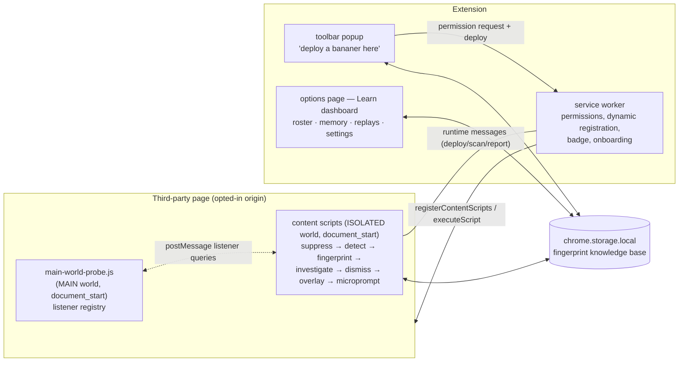
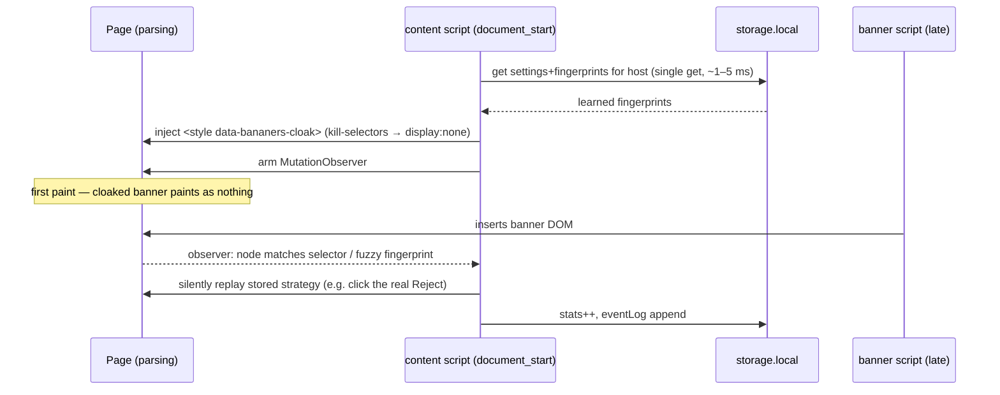

# Bananers — Technical Design

**Popup-Dismissing Learning Companions.** Deployable banana characters that
investigate third-party popups (cookie consent modals, ad interstitials,
newsletter overlays), dismiss them in character, and remember how — so the
next encounter is suppressed before the user ever perceives it.

This document is the technical-design deliverable from the feature spec:
fingerprinting & storage schema, the document_start suppression mechanism,
the content-script/dashboard split, and the character/animation framework,
plus the Banana God extension point and the honest limitations list.

---

## 1. Why a browser extension (platform decision)

The spec's requirement set is only satisfiable by a Manifest V3 extension:

| Requirement | Why a sandboxed web app can't | Extension mechanism |
|---|---|---|
| Act on popups on arbitrary third-party origins | Same-origin policy | Content scripts |
| Inspect "all code" of the host page (DOM/CSS/listeners) | No cross-origin DOM access | Isolated-world content script + MAIN-world probe |
| Suppress at/before first paint | Cannot run before a third-party page paints | `document_start` injection |
| Persist a knowledge base across sites | Storage is per-origin | `chrome.storage.local` |

## 2. Architecture: what runs where



**No build step.** Every module is a plain script attaching to a
`globalThis.Bananers` namespace, so identical files load as content scripts,
in extension pages (`<script src>`), and in the service worker
(`importScripts`). Load-unpacked works straight from the source tree.

**Split of responsibilities.** Content scripts own everything page-local
(detection, inspection, dismissal, animation, storage writes for learning).
The service worker owns everything privileged (dynamic script registration,
permission lifecycle, per-tab badge). The popup owns the user-gesture-bound
permission request. The dashboard owns the "Learn" experience and settings.

## 3. Permission model (opt-in by design)

- Manifest requests **zero host permissions**; only `storage`, `scripting`,
  `activeTab`, plus `optional_host_permissions: ["<all_urls>"]`.
- First deploy on a site: the popup calls `chrome.permissions.request` for
  `scheme://host/*` (the request must originate in the popup to carry the
  user gesture). Declining still allows a one-shot deploy via `activeTab`;
  granting lets the SW register persistent `document_start` content scripts
  for that origin (`chrome.scripting.registerContentScripts`,
  `persistAcrossSessions: true`).
- Every grant is listed with a revoke button in Settings; the onboarding page
  discloses the model in plain language. This per-site scoping is exactly the
  kind of factor the future Banana God policy layer will reason about.

## 4. Fingerprinting & storage schema

### 4.1 Fingerprint

A banner is identified by `host + structural signature`:

- **Token set** — normalized structural features: container tag / stable id
  and class tokens, notable attribute *names* (`role`, `aria-modal`,
  `data-*`), a breadth-first sample of descendant tags/ids/classes,
  vocabulary words present in the text (from a fixed keyword list — raw page
  text is never stored), and geometry buckets (fixed-position, coverage
  bucket). Random-looking tokens (≥3 digits, long hex, vowel-less minified
  strings) are dropped, so hashed-build class names don't break recognition.
- **Hash** — FNV-1a over the sorted token set; primary key
  `fpId = host::hash`.
- **Selector** — best-effort stable unique selector (stable id → stable
  class combo → data-attribute → role → positional fallback), used by the
  cloak and the recall matcher.

**Drift tolerance (spec: "across minor DOM/markup variations"):** exact hash
match first; on miss, Jaccard similarity of token sets with threshold 0.6
against the host's stored fingerprints. A re-learn on a drifted banner
updates the existing record (new signature, same identity) rather than
duplicating it.

### 4.2 Storage layout (`chrome.storage.local`)

```
meta          { schemaVersion: 1 }
settings      { onboarded, defaultBananer, suggestBananer,
                typeOverrides: { [type]: { show } },     // per-type opt-in (§7)
                safety: { neverAccept: true }, reducedMotion }
microPrompt   { shownForType: { [type]: true } }          // one-time, forever
fingerprints  { [fpId]: {
                  id, host, origin, type,
                  signature: { hash, tokens[], selector },
                  strategy:  { kind, clickSelector?, killSelectors[], scrollLock },
                  bananerId, createdAt, lastSeenAt,
                  timesDismissed, timesFailed,
                  replay: [ { t, act, label } ] } }       // ≤40 steps
hostIndex     { [host]: [fpId] }                          // O(1) per-host lookup
eventLog      [ { ts, host, fpId, type, bananerId, action, outcome } ]  // ring ≤200
```

Keys are top-level so the pre-paint path fetches only
`settings + fingerprints + hostIndex` in a single `get()`. `hostIndex` keeps
the hot path independent of total knowledge-base size.
`chrome.storage.sync` cross-device recall is a stretch goal — the record
format fits, but sync quotas (100 KB total, 8 KB/item) mean only
`settings`/`typeOverrides` sync safely today; fingerprints would need
per-host sharding and eviction (see plan, phase 4).

### 4.3 Strategy kinds

| kind | what is replayed | typical learner |
|---|---|---|
| `click-dismiss` | click the stored reject/close control (full pointer-event sequence) | Peel Noir, Bruce |
| `event-dispatch` | Escape key protocol, then ranked click fallback | Glitch |
| `slice-remove` | remove popup node + backdrops, unlock scroll | Splitsu |
| `css-kill` | inject `display:none !important` kill-selectors, unlock scroll | Frost Peel |

Whatever the character *tried*, what is recorded is what *worked* (fallback
chains, §6.3) — memory stores outcomes, not intentions.

## 5. document_start suppression — "cloak, then close"



Two layers with distinct jobs:

1. **Cloak (perception):** the injected stylesheet guarantees that any DOM
   matching a learned kill-selector *renders as nothing*, no matter when it
   arrives. This is what makes suppression pre-paint rather than
   flash-and-close. **Only *stable* selectors** (identity-anchored: id, class,
   data-attribute, role) are ever cloaked; positional `nth-of-type` fallbacks
   are never pre-paint-hidden, because a later DOM-order change could point
   them at unrelated first-party content. Positional selectors are still used
   post-insertion, but only after verification (below).
2. **Close (semantics):** recognition via the MutationObserver replays the
   real strategy — e.g. actually clicking the site's own "Reject all" so the
   site registers refusal and stops re-serving the banner. **Every match is
   re-verified** against the stored fingerprint (tokenize + similarity) before
   any destructive action, and fuzzy matching runs *only* on popup-like
   elements — so a structurally-similar SPA wrapper is never removed by a
   `slice-remove` strategy. On a drift match the element is hidden immediately,
   before the strategy runs, so recognition never degrades to a visible
   flash-and-close. While cloaked, a click target computes `display:none`, so
   click/Escape recall verifies *removal from the DOM* rather than invisibility;
   the stored control is activated at most once across the retry loop (so a
   consent API call is never fired repeatedly).

**Honest boundary.** The storage read is asynchronous; for banners present in
the initial server HTML there is a theoretical race with the very first
paint. In practice the read resolves in single-digit milliseconds — before
parsing reaches `<body>` on almost any real page, and cookie/ad scripts
inject far later. If field data ever shows losses, the documented escalation
is a synchronous per-origin selector cache (e.g. namespaced page
`localStorage`), trading storage hygiene for a hard guarantee — deliberately
not implemented in v1.

## 6. Detection, investigation, dismissal

### 6.1 Detection (`detect.js`)
Candidates = visible elements that are fixed/sticky or `role=dialog` /
`aria-modal`, with viewport coverage ≥ 8% (or full-width top/bottom bars).
Scored by coverage + z-index + dismiss-affordance presence + type
classification (keyword vocab + CMP-vendor id/class tokens + email-input
heuristic). Bare full-screen veils with no text/controls are classified as
*backdrops* and attached to the real candidate. Our own overlay
(`data-bananers-ui`) is excluded. Nested candidates dedupe to the outermost.

### 6.2 Dismiss-candidate ranking & the safety invariant
Clickables inside the popup are labeled (aria-label > text > value) and
classified: `reject` (preferred, ordered by the REJECT_WORDS list) > `close`
(glyphs, close/dismiss semantics, small-top-right-corner geometry) >
`neutral` > `accept`. The accept guard is **fail-closed**: *any* accept word
in a control's accessible name marks it `accept`, and a control bearing *both*
accept and reject phrasing is treated as ambiguous — neither is ever clicked.
Under `neverAccept` (default), click strategies only ever activate
*positively identified* `reject`/`close` controls; unrecognized `neutral`
controls — including localized labels the word lists don't cover (e.g. German
`Alle akzeptieren`/`Alle ablehnen`) — are never clicked and fall through to
containment (slice/css-kill). This closes the hole where DOM order could
otherwise decide that an unrecognized Accept button gets clicked first.
`realClick()` re-checks the label as a final line of defense. The e2e suite
asserts the site recorded *rejected* consent on English banners and that
*neither* control is clicked on a localized one.

### 6.3 Fallback chains
Every deploy ends popup-free (utility first): each character leads with its
signature technique and falls back, terminating in `css-kill`:
`click → escape → slice → css-kill` (Peel Noir/Bruce),
`escape → click → slice → css-kill` (Glitch), `slice → css-kill` (Splitsu),
`css-kill → slice` (Frost Peel). Cross-origin-iframe CMPs (§9) force the
containment-only chain.

### 6.4 Listener tracing (`main-world-probe.js`)
Isolated-world scripts can't see page listeners, so a MAIN-world probe
wraps `EventTarget.prototype.addEventListener` at `document_start` and keeps
a WeakMap registry. The isolated world queries it over `postMessage` using a
temporary `data-` attribute to identify the element. Coverage: listeners
added *after* document_start (in practice: all banner scripts). The channel
is spoofable by the page, so probe data informs **display/ranking only**,
never a privileged action.

## 7. Entertainment opt-in layer

- After the **first successful interactive dismissal** of a given banner
  type, one micro-prompt: *"Enjoyed that? Keep showing me [type] popups so I
  can deal with them."* `microPrompt.shownForType[type]` is set atomically
  **before** the card renders — either button, the ×, or the 20 s timeout all
  count as shown; it never reappears for that type.
- The dashboard's per-type toggles are the persistent, revisitable control.
- Default remains *close before I see it*; the override is per-type only —
  there is deliberately no global "show everything" switch.
- When a type is opted in, the policy returns `show` and the page-load path
  neither cloaks nor recalls for fingerprints of that type.

## 8. Character & animation framework

Each bananer is one record in `shared/characters.js` binding the three
mandated axes to one personality — adding a character is adding a record:

| | Appearance (SVG sprite) | Investigation style | Closing technique → strategy |
|---|---|---|---|
| **Peel Noir** | half-peeled, trench coat & fedora | `structural` — DOM/attribute dossier | *picks the lock* → `click-dismiss` |
| **Splitsu** | ninja wrap, katana | `visual` — geometry/affordance sweep | *clean slice* → `slice-remove` |
| **Glitch** | sunglasses, laptop, code rain | `listeners` — probe traces + inline handlers | *speaks machine* → `event-dispatch` |
| **Bruce Bananer** | boxing gloves | `brute` — ranked clickable inventory | *haymaker* → ranked `click-dismiss` |
| **Frost Peel** | frozen, magnifying glass | `styles` — computed styles, z-stack, scroll locks | *deep freeze* → `css-kill` |

The overlay is a single max-z fixed host with an **open** shadow root
(testable, namespaced, `pointer-events:none` except interactive cards).
Investigation steps stream through a controller (`step(label, rect)`) that
renders per-style effects (scan boxes, sweeping lens, code rain, frost) and
per-technique finishers (slash, impact, freeze). Every step is also appended
to the fingerprint's `replay` log, which the dashboard re-animates — the
educational layer costs no extra instrumentation. `prefers-reduced-motion`
(or the setting) collapses the show to brief captions.

Suggestion map: cookie → Peel Noir, newsletter → Splitsu, ad → Frost Peel,
generic → Bruce (a plain map, replaceable by the future policy layer).

## 9. Banana God extension point (flag only — spec §7)

`shared/policy.js` defines the decision seam: every show/suppress/engage
choice flows through `Bananers.policy.decide(ctx)` where
`ctx = { host, origin, type, fingerprint, settings, encounter }` and the
result is `{ action: 'suppress'|'show'|'engage', bananerId?, reason }`.
Today's installed policy is the transparent default (per-type override →
learned strategy → engage). A future orchestrator calls
`Bananers.policy.install(...)` and receives every decision with full context
— no storage-schema or content-script changes required. Per the spec,
**no orchestrator logic is implemented**; the dashboard mentions it only as
a forward-looking note.

## 10. Non-goals honored & honest limitations

- **No Banana God logic** — interface only (§9).
- **No cross-user/shared learning** — all memory is per-device
  `storage.local`; nothing leaves the machine.
- **No anti-adblock/anti-automation bypassing.** Flagged concretely:
  cookie-wall CMPs rendered inside **cross-origin iframes** (Sourcepoint
  et al.) cannot be inspected or clicked from the top frame. Bananers
  *contains* them (remove/css-kill the host container) and says so in the
  investigation narration, rather than attempting evasion. Sites that detect
  synthetic events and re-serve banners are likewise out of scope — the
  fallback is containment, not an arms race.
- **No handling of the product's own UI** — content scripts run only on
  opted-in third-party origins; the overlay tags its own DOM and detection
  excludes it.
- Shadow-DOM-internal banners and `visibility`-toggled (pre-inserted) banners
  are known detection gaps tracked in the implementation plan.
- The MAIN-world listener probe modifies `EventTarget.prototype` — visible to
  the page (as with all anti-fingerprinting-sensitive instrumentation). It
  degrades gracefully: with no probe reply, Glitch falls back to inline
  handlers + Escape protocol.

## 11a. Post-review hardening

After the initial implementation an adversarial multi-agent review and an
independent automated reviewer converged on the same defect classes; all were
fixed and are now regression-tested:

- **Positional-selector safety (critical).** Positional `nth-of-type`
  selectors are excluded from the pre-paint cloak, and every selector match is
  verified against the fingerprint before any destructive action; fuzzy
  matching is restricted to popup-like elements (§5). Prevents hiding/removing
  first-party content on later visits.
- **Fail-closed accept guard + neutral-not-clicked (§6.2).**
- **Storage lost updates.** `patch()` writes back only the top-level keys a
  mutation touched, so a settings write can't clobber a fingerprint write from
  another context (§4.2).
- **Service-worker robustness.** Registration is single-flight (no
  duplicate-ID race between `permissions.onAdded` and `GRANT_AND_DEPLOY`), the
  first deploy injects even if registration sync fails, and per-tab report
  state lives in `chrome.storage.session` (survives SW termination), cleared on
  navigation.
- **Distinct techniques.** Peel Noir uses a precise single-control click
  (`click-precise`); Bruce uses the exhaustive ranked loop (`click-dismiss`) —
  no two characters share a closing implementation (spec §3).
- **Navbar false-positive.** Full-width bars are only treated as banners with
  positive evidence (recognized type, reject/close affordance, or CMP token)
  and never when they are link-heavy nav strips.
- **Scroll restore / revoke teardown.** A released scroll lock restores the
  site's prior inline value rather than forcing `overflow:visible` forever;
  revoking an origin messages open tabs to disconnect observers and remove
  cloak styles.
- **In-memory recall freshness.** A freshly learned record is merged into the
  live suppression snapshot so an SPA re-insertion recalls it instead of
  re-learning.

## 11. Test strategy

`test/run-tests.mjs` runs the real extension in headless Chromium (Playwright
`channel: 'chromium'`) against six synthetic banner pages (49 assertions),
covering the spec's behavioral contract end-to-end: learn/dismiss per character
strategy, never-accept (the page records *rejected* consent), pre-paint cloak
presence + not-visible-at-insertion on revisit, silent strategy replay,
one-time micro-prompt semantics, per-type opt-in round-trip, css-kill + scroll
unlock, and dashboard/popup rendering — plus the post-review hardening (§11a):
localized-label safety (neither Accept nor Reject clicked), sticky-navbar
non-detection, and positional-selector safety (first-party content stays
visible and un-removed across a DOM-order shift while the drifted banner is
still suppressed). The production manifest stays permissionless; the harness
bakes the post-opt-in state (static `127.0.0.1` grant) into a scratch copy,
since native permission prompts aren't drivable in tests.
