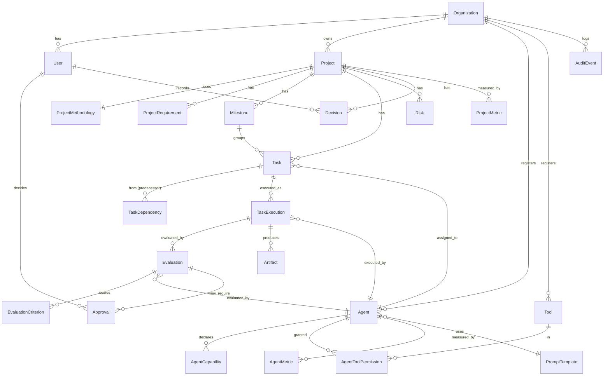

# AgentiCubed — Data Model

All entities carry `id` (UUID), `created_at`, `updated_at` (UTC) unless noted.
Append-only entities (marked **immutable**) carry `created_at` only and reject
application-layer updates/deletes.

## Entity-relationship overview

## Core entities

### Organization
Top tenant boundary. All other rows are scoped to an `organization_id`.

### User
`organization_id`, `email` (unique per org), `hashed_password`, `is_active`,
`system_role` (`owner` | `admin` | `member`). Project-scoped roles live in a
join (`ProjectMember`: user, project, `project_role` ∈ `manager`|`contributor`|`approver`|`viewer`).

### Project
`organization_id`, `name`, `objective` (free text), `status`
(`intake`|`planning`|`active`|`blocked`|`closed`), `acceptance_criteria` (JSON),
`created_by`.

### ProjectMethodology
One per project. `methodology` (`kanban`|`scrum`|`waterfall`|`cpm`|`ccpm`|`hybrid`),
`recommended_by` (`system`|`user`), `rationale`, `config` (JSON — e.g. sprint
length, WIP limits, buffer sizing for CCPM).

### ProjectRequirement
`project_id`, `kind` (`functional`|`nonfunctional`|`constraint`|`acceptance`),
`text`, `priority` (`must`|`should`|`could`|`wont`), `source`.

### Milestone
`project_id`, `name`, `due_date` (nullable), `status`, `order_index`.

### Task
`project_id`, `milestone_id` (nullable), `title`, `description`,
`status` (execution state — see state machine), `kanban_column`
(`backlog`|`ready`|`in_progress`|`review`|`done`), `assigned_agent_id` (nullable),
`required_capabilities` (JSON list), `estimate_hours`, `priority`,
`is_human_task` (bool), `wbs_code` (e.g. `1.2.3`), `order_index`.

### TaskDependency
`project_id`, `predecessor_task_id`, `successor_task_id`,
`dependency_type` (`finish_to_start`|`start_to_start`|`finish_to_finish`|`start_to_finish`),
`lag_hours`. **Unique** on (predecessor, successor). Cycle-checked on write.

### TaskExecution  *(immutable)*
`task_id`, `agent_id`, `attempt_number`, `state` (terminal snapshot),
`input_context` (JSON, secret-free), `output` (JSON/text), `tokens_used`,
`cost_estimate`, `started_at`, `finished_at`, `error` (nullable),
`provider_request_id` (internal provider receipt), `workflow_handle` (engine
reference), `remediation_of` (nullable →
prior TaskExecution that this attempt remediates).

### Agent
`organization_id`, `name`, `kind` (`ai`|`human`), `provider` (nullable for
human), `model` (nullable), `prompt_template_id` (nullable), `status`
(`active`|`disabled`), `default_role` (`executor`|`evaluator`|`either`),
`config` (JSON, **no secrets** — credentials referenced by key only).

### AgentCapability
`agent_id`, `capability` (taxonomy key, e.g. `research.web`, `analysis.python`,
`writing.brief`, `viz.chart`), `proficiency` (1–5), `evidence` (nullable).

### Tool
`organization_id`, `name`, `kind` (`http`|`python_fn`|`shell`|`data_source`),
`description`, `schema` (JSON — input/output contract),
`sensitivity` (`low`|`medium`|`high` — high requires approval to invoke).

### AgentToolPermission
`agent_id`, `tool_id`, `scope` (JSON — e.g. allowed domains, read-only),
`granted_by`, `expires_at` (nullable). Least-privilege: absence = denied.
Agents cannot create/alter their own permissions (enforced by RBAC + audit).

### Evaluation  *(immutable)*
`task_execution_id`, `evaluator_agent_id` (nullable for deterministic),
`evaluator_kind` (`deterministic`|`agent`|`human`), `verdict`
(`pass`|`fail`|`needs_revision`), `score` (0–1), `summary`, `gaps` (JSON list of
gap descriptors feeding remediation).

### EvaluationCriterion  *(immutable)*
`evaluation_id`, `criterion` (rubric key), `weight`, `passed` (bool),
`score`, `notes`.

### Approval
`task_execution_id` (nullable) / `project_id`, `requested_action`,
`risk_level`, `status` (`pending`|`approved`|`rejected`), `decided_by` (User),
`decided_at`, `comment`. Gates irreversible/sensitive actions.

### Risk
`project_id`, `title`, `description`, `likelihood` (1–5), `impact` (1–5),
`severity` (computed), `status` (`open`|`mitigating`|`closed`),
`mitigation`, `owner_user_id`.

### Decision
`project_id`, `title`, `context`, `decision`, `consequences`,
`decided_by`, `decided_at`. Project-level decision log (distinct from ADRs,
which are repo-level engineering decisions).

### Artifact
`project_id`, `task_execution_id` (nullable), `name`, `content_type`,
`storage_key` (ArtifactStore reference — not the bytes), `size_bytes`,
`sha256`, `produced_by_agent_id`.

### AuditEvent  *(immutable)*
`organization_id`, `actor_type` (`user`|`agent`|`system`), `actor_id`,
`action` (verb), `entity_type`, `entity_id`, `before` (JSON, redacted),
`after` (JSON, redacted), `ip` (nullable), `occurred_at`. Emitted for every
material state change.

### ProjectMetric
`project_id`, `metric` (`schedule_variance`|`tasks_completed`|`cycle_time`|…),
`value`, `as_of`, `dimensions` (JSON). Feeds dashboards and Power BI exports.

### AgentMetric
`agent_id`, `metric` (`success_rate`|`avg_score`|`avg_tokens`|`reassignment_rate`|…),
`value`, `as_of`, `dimensions` (JSON).

### PromptTemplate
`organization_id`, `name`, `version`, `role` (`executor`|`evaluator`),
`template` (text with named slots), `input_schema` (JSON). Secrets are never
embedded; runtime context is injected by the orchestration layer.

## Invariants enforced in code

1. `TaskDependency` graph is acyclic per project.
2. `TaskExecution`, `Evaluation`, `EvaluationCriterion`, `AuditEvent` are
   append-only.
3. Executor `agent_id` ≠ evaluator `agent_id` for the same execution.
4. An `Agent` cannot be the actor that creates/modifies its own
   `AgentToolPermission`.
5. Every row is scoped to exactly one `Organization`; cross-org reads denied.
6. State transitions follow the execution state machine; illegal transitions
   are rejected and audited.
