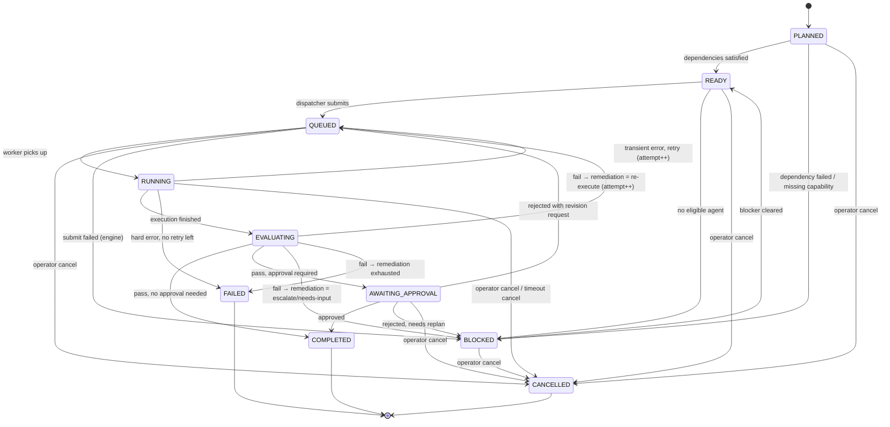

# AgentiCubed — Execution State Machine

The execution state machine governs the lifecycle of a **Task** (and the
`TaskExecution` attempts within it). It is durable: state lives in PostgreSQL,
transitions run inside DB transactions, and each transition emits an
`AuditEvent`. The worker layer is driven by these states but does not own them —
state is owned by the domain service so a different `WorkflowEngine` (Temporal)
can drive the same machine.

## States

| State | Meaning |
|-------|---------|
| `PLANNED` | Task exists in the plan; dependencies not yet satisfied. |
| `READY` | All predecessor dependencies `COMPLETED`; eligible for dispatch. |
| `QUEUED` | Submitted to the WorkflowEngine; awaiting a worker. |
| `RUNNING` | A worker is executing the assigned agent; a `TaskExecution` row is open. |
| `EVALUATING` | Output produced; evaluator (deterministic/agent/human) scoring it. |
| `AWAITING_APPROVAL` | Passed evaluation but requires a human approval gate. |
| `COMPLETED` | Accepted. Terminal (success). |
| `FAILED` | Exhausted remediation/retries, or hard error. Terminal (failure). |
| `BLOCKED` | Cannot proceed (failed dependency, missing capability/credential, rejected approval). Recoverable. |
| `CANCELLED` | Operator cancelled. Terminal. |

## Transition diagram

## Authoritative transition table

The state machine is implemented as a data-driven table in
`backend/app/orchestration/state_machine/transitions.py`. Any transition not in
the table is rejected with `IllegalTransition` and audited.

| From | Event | Guard | To |
|------|-------|-------|----|
| PLANNED | `deps_satisfied` | all predecessors COMPLETED | READY |
| PLANNED | `dep_failed` | a predecessor FAILED/CANCELLED | BLOCKED |
| PLANNED | `cancel` | — | CANCELLED |
| READY | `dispatch` | agent assigned & permitted | QUEUED |
| READY | `no_agent` | matching found none | BLOCKED |
| READY | `cancel` | — | CANCELLED |
| QUEUED | `worker_start` | — | RUNNING |
| QUEUED | `submit_failed` | engine error | BLOCKED |
| QUEUED | `cancel` | — | CANCELLED |
| RUNNING | `exec_finished` | output captured | EVALUATING |
| RUNNING | `transient_error` | attempt < max_retries | QUEUED |
| RUNNING | `hard_error` | attempt ≥ max_retries | FAILED |
| RUNNING | `timeout` | — | CANCELLED |
| EVALUATING | `eval_pass` | approval not required | COMPLETED |
| EVALUATING | `eval_pass_gate` | approval required | AWAITING_APPROVAL |
| EVALUATING | `eval_fail_retry` | remediation = re-execute & budget left | QUEUED |
| EVALUATING | `eval_fail_escalate` | remediation = escalate/needs-input | BLOCKED |
| EVALUATING | `eval_fail_exhausted` | remediation budget exhausted | FAILED |
| AWAITING_APPROVAL | `approved` | — | COMPLETED |
| AWAITING_APPROVAL | `rejected_revise` | revision requested | QUEUED |
| AWAITING_APPROVAL | `rejected_replan` | — | BLOCKED |
| AWAITING_APPROVAL | `cancel` | — | CANCELLED |
| BLOCKED | `unblocked` | blocker resolved | READY |
| BLOCKED | `cancel` | — | CANCELLED |

## Attempts and immutability

- Each `RUNNING` entry opens exactly one **immutable** `TaskExecution` row
  (`attempt_number` increments per re-execution).
- Re-execution after a failed evaluation links the new attempt via
  `remediation_of` to the prior `TaskExecution`, and records the selected
  `RemediationAction` + justification (see `docs/architecture.md` §4 and the
  remediation policy).
- Terminal states (`COMPLETED`, `FAILED`, `CANCELLED`) never transition out.
  `BLOCKED` is the only non-terminal "stuck" state and recovers via `unblocked`.

## Retry / remediation budgets

Two distinct budgets, both configurable per project:
- **Retry budget** — transient infrastructure errors (`RUNNING → QUEUED`).
- **Remediation budget** — evaluation failures (`EVALUATING → QUEUED`). When
  exhausted, the task escalates (`BLOCKED`) or fails (`FAILED`) per policy.

## Concurrency & idempotency

- Transitions use optimistic concurrency (a `version` column on `Task`); a
  stale transition is rejected and retried by the caller.
- Worker callbacks are idempotent keyed on `(execution_id, event)` so duplicate
  deliveries from the message broker do not double-advance state.
