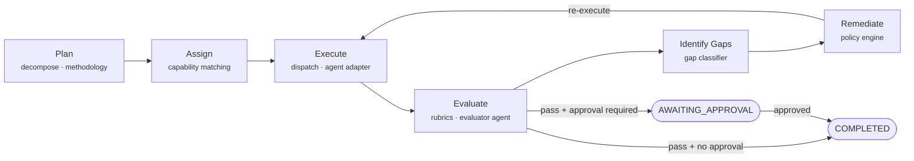
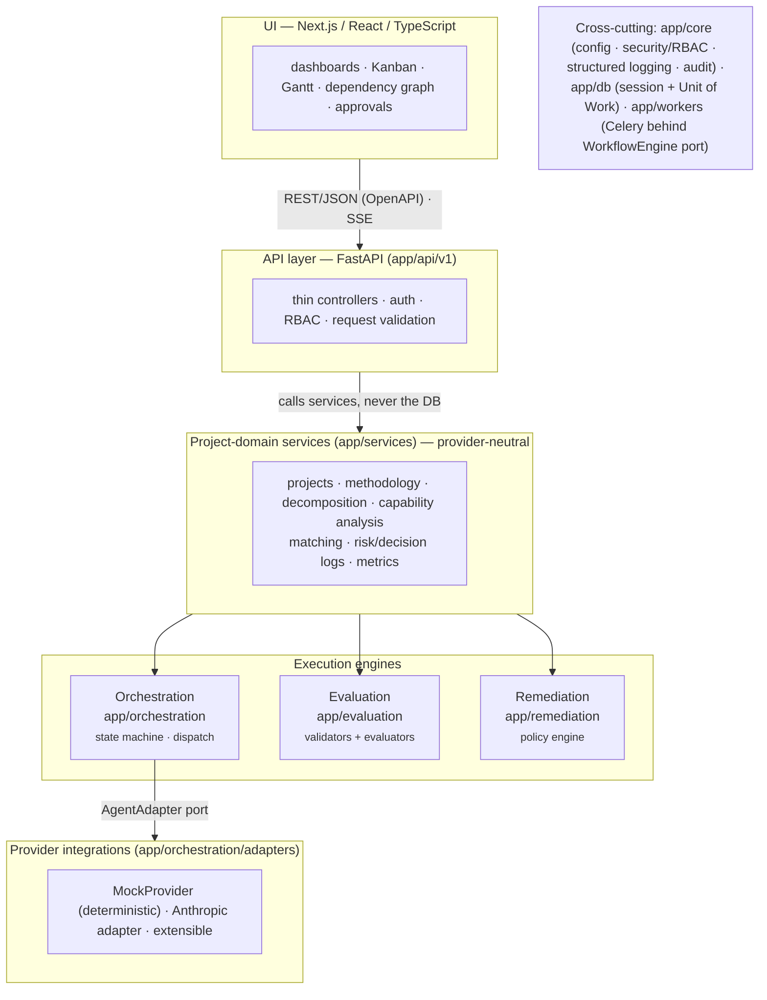
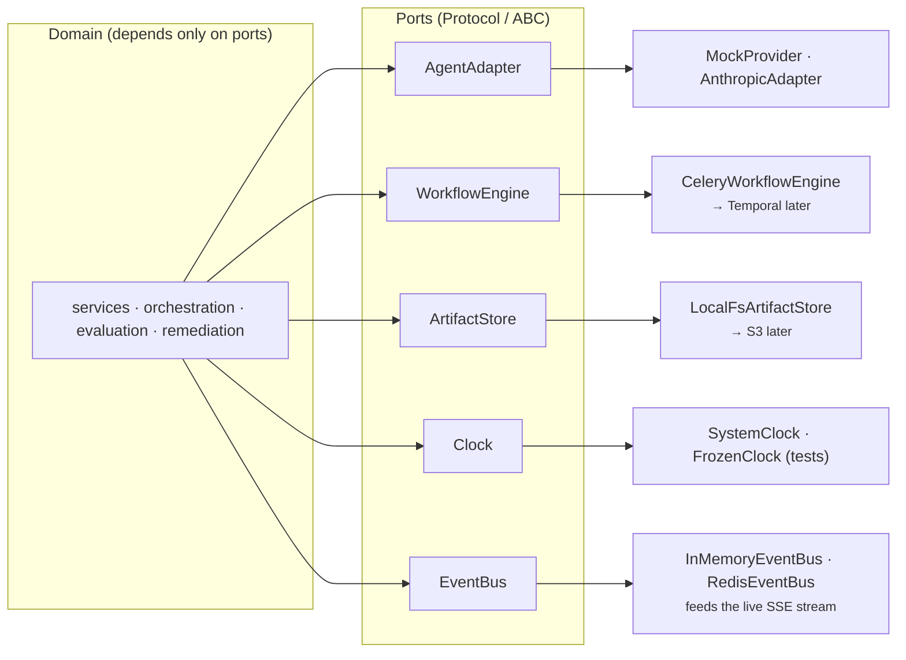
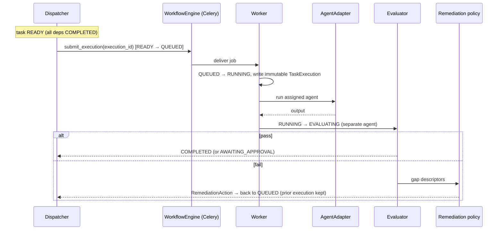
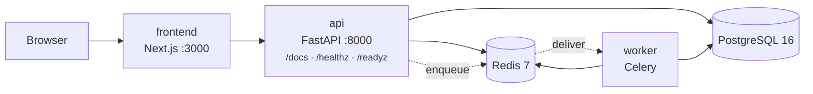

# AgentiCubed — System Overview (Visual)

A one-page, diagram-first view of the platform. This complements the prose
[`PROJECT_SUMMARY.md`](PROJECT_SUMMARY.md) and the detailed
[`architecture.md`](architecture.md); the diagrams below are the same
component and control-loop boundaries drawn visually.

Deeper references: [`data-model`](data-model.md) ·
[`execution-state-machine`](execution-state-machine.md) ·
[`security-model`](security-model.md) · [`roadmap`](roadmap.md) ·
[`demo`](demo.md) · ADRs in [`decisions/`](decisions/).

---

## 1. The control loop

Everything the platform does is one closed loop over each task, run until
acceptance criteria are met.

| Loop step | Component | Output |
|-----------|-----------|--------|
| Plan | `services/decomposition`, `services/methodology` | Tasks, dependencies, milestones, WBS |
| Assign | `services/matching` | Task → Agent assignments |
| Execute | `orchestration/dispatch` + `workers` + `AgentAdapter` | `TaskExecution` records |
| Evaluate | `evaluation/` | `Evaluation` + `EvaluationCriterion` results |
| Identify Gaps | `evaluation/` (gap classifier) | Structured gap descriptors |
| Remediate | `remediation/policy` | Selected `RemediationAction` + justification |
| Re-execute | back to dispatch | new `TaskExecution`, prior ones immutable |

---

## 2. Layered architecture

Dependencies point **inward**. Domain services never import a model SDK,
Celery/Redis, or FastAPI request objects — only ports.

---

## 3. Ports & adapters (the seams that protect the constraints)

Domain code depends only on the ports on the left. Concrete adapters are wired
at the edges, so each can be swapped without touching domain logic.

| Port | Purpose | MVP adapter(s) | Future swap |
|------|---------|----------------|-------------|
| `AgentAdapter` | Run a prompt/tool-call against a model | `MockProvider`, `AnthropicAdapter` | Any provider |
| `WorkflowEngine` | Enqueue/track durable task execution | `CeleryWorkflowEngine` | `TemporalWorkflowEngine` |
| `ArtifactStore` | Persist project artifacts | `LocalFsArtifactStore` | `S3ArtifactStore` |
| `Clock` | Time source (testable) | `SystemClock` | `FrozenClock` |
| `EventBus` | Live domain-event fan-out (SSE feed) | `InMemoryEventBus`, `RedisEventBus` | NATS / Kafka |

---

## 4. Execution flow (happy path + remediation branch)

The executor and evaluator of a given `TaskExecution` are always different
agents — enforced by the dispatcher and the API (ADR-0004). Full transition
table: [`execution-state-machine.md`](execution-state-machine.md).

---

## 5. Deployment topology (Docker Compose)

Published ports bind to loopback by default. Bring the stack up with
`docker compose up --build`; run the seeded end-to-end demonstration from the
repo root with `make demo` (see [`demo.md`](demo.md)).

---

## 6. Hard constraints (why the seams exist)

1. **Provider neutrality** — all model interaction goes through `AgentAdapter`;
   no domain module imports a provider SDK.
2. **Durability & auditability** — `TaskExecution`, `Evaluation`, and
   `AuditEvent` are append-only at both the app and DB layers.
3. **Separation of concerns** — project, orchestration, provider, and UI layers
   are independent; dependencies point inward.
4. **Replaceable worker layer** — domain code depends on the `WorkflowEngine`
   port, so Celery can be replaced by Temporal without rewriting domain logic.
