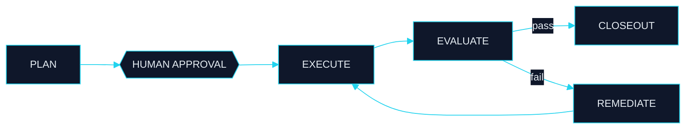

<picture>
  <source media="(prefers-color-scheme: dark)" srcset="assets/hero-dark.svg">
  <source media="(prefers-color-scheme: light)" srcset="assets/hero-light.svg">
  
</picture>

**[SYSTEMS](#-active-systems)** · **[METHOD](#-method)** · **[STACK](#-stack)** · **[OPEN QUESTIONS](#-open-questions)** · **[CONTACT](#-contact)**

---

I build the layer that decides whether an agent *should* act — approval gates, independent evaluation, default-deny permissions, append-only audit — and treat every model provider and platform as a swappable adapter at the edge.

Most agentic systems die one of three ways: the agent does something irreversible nobody approved, the agent grades its own work, or a vendor retires an API. None of the three is a model-quality problem. All three are structural.

<!-- Update this block as things change. It is the most-read line on the page. -->
> **NOW** — Building **AgentiCubed**, an operating layer for governed agentic work. At **AI4 in Las Vegas** this month; looking for people with production scar tissue in agent governance, evaluation, and cross-platform identity.

---

### ▍ ACTIVE SYSTEMS

| System | What it is | State |
|---|---|:--|
| **[AgentiCubed / A³](https://github.com/AgentiCubed)** | Agentic project-orchestration platform. Objectives → governed task graph → agent assignment → independent evaluation → bounded remediation → gated closeout. | `BUILD` `PRIVATE` |
<!-- This link goes live when the showcase is published per docs/showcase/PUBLICATION-CHECKLIST.md. Confirm the repo exists before publishing this profile. -->
| **[A³ Showcase](https://github.com/AgentiCubed/agenticubed-showcase)** | Public conceptual showcase for the above — problem, thesis, architecture, trust boundaries, provenance. Read this one first. | `STAGED` |
| **[petrichor](https://github.com/AgentiCubed/petrichor)** | Grounded valence, olfaction-first: thesis plus a state-flip demo. | `RESEARCH` |
| **[BoomerEZ](https://github.com/JamesTRichmond/BoomerEZ)** | Free, single-file programs for people who were never taught the computer words. Nothing to install, nothing to sign up for. | `LIVE` |
| **[SalesAssistant](https://jamestrichmond.github.io/SalesAssistant/)** | Deployed sales-support tool. | `LIVE` |
| **[Prompt Dashboard](https://github.com/JamesTRichmond/Prompt-Dashboard)** | Human-centered dashboard for building clearer model requests and choosing a launch path. | `LIVE` |
| **[StreamKill](https://github.com/JamesTRichmond/StreamKill)** | <!-- TODO: one line. Repo has no description set — add one there too. --> | `BUILD` |
| **[Verbal Kombat](https://github.com/JamesTRichmond/Verbal_Kombat)** | A fighting game where attacks are landed through sound arguments and logic. | `BUILD` |
| **[LordAinz](https://lordai.nz/)** | Static landing page for the Sorcerer-King familiar. | `STAGED` |

---

### ▍ METHOD

The loop everything runs through. The evaluator is never the executor — enforced at dispatch and again at write, not requested in a prompt.

<b>The four invariants</b>

 

| # | Invariant | Enforced how |
|:--|---|---|
| 01 | **Separation of execution and judgment** | The actor that produced an output can never grade it. Checked at dispatch and again at write. |
| 02 | **Irreversible actions block on a human** | A recorded decision is required regardless of standing permission. Default-deny, not default-send. |
| 03 | **History is append-only** | At the application layer and the storage layer. What was decided, by whom, on what evidence. |
| 04 | **Platforms are adapters, never architecture** | The domain defines ports; vendors conform. A retired provider becomes a tombstone that fails readably with migration guidance — not a deletion that turns every stored reference into an opaque crash. |

Invariant 04 is not theoretical. A model provider was retired mid-build on this project. The response was not a vendor swap — it was generalizing the adapter layer so the next retirement costs a configuration change.

---

### ▍ STACK

---

### ▍ OPEN QUESTIONS

Genuinely open. I would rather be argued with than agreed with.

1. **Where does the approval gate belong** — per action, per plan, or per policy? Per action does not scale. Per policy is how you approve something you did not read.
2. **Should evaluation be structural or statistical?** Structural separation is enforceable. Does it survive scale, or become a bottleneck that gets quietly relaxed?
3. **What does durable cross-platform identity actually require** in the presence of platforms that actively resist correlation — and should it?
4. **What is the right unit of agent memory?** Per project is tractable and wrong. Per subject is right and hard. What is the intermediate step?
5. **What breaks first when you give an agent a real account?** My money is on diagnostic legibility, not autonomy limits.

---

### ▍ CONTACT

Open to **AI engineering and solutions roles**, and to collaboration on agent governance, evaluation substrate, and cross-platform identity.

<!-- Fill these in before publishing. Use a public-facing address, not a personal inbox. -->

| | |
|---|---|
| **Email** | `<add public-facing address>` |
| **LinkedIn** | `<add>` |
| **Org** | [@AgentiCubed](https://github.com/AgentiCubed) |
| **Talk to me about** | agent governance · evaluation that isn't self-graded · cross-platform identity · what actually broke when you shipped it |
