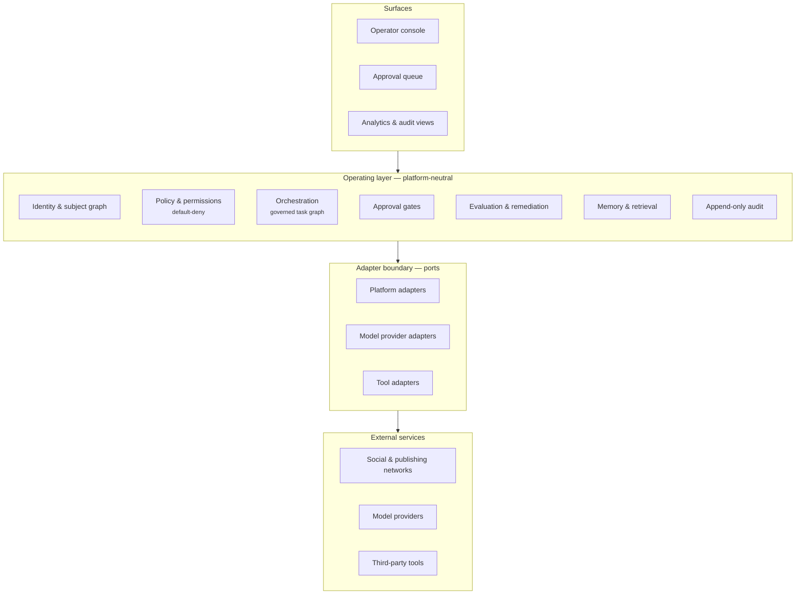
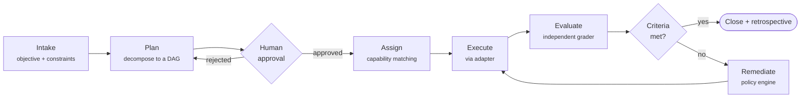
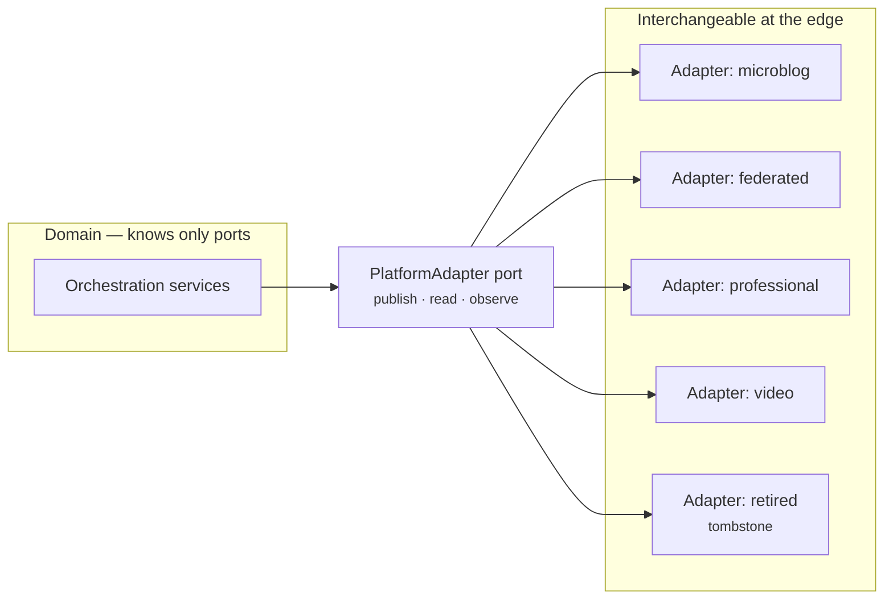
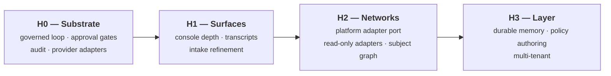

# AgentiCubed

**An agentic operating layer for work that spans systems you do not control.**

AgentiCubed (also written **Agentic³** or **A³**) is a platform-neutral operating
layer that sits *above* fragmented networks and services. Instead of one more
integration that logs into one more account, it treats identity, content,
monitoring, agent workflows, approvals, memory, and cross-platform intelligence
as first-class primitives — coordinated once, then projected onto whichever
services happen to exist that year: X, Threads, Bluesky, Mastodon, LinkedIn,
Reddit, YouTube, and whatever replaces them.

This repository is a **public conceptual showcase**. It explains the problem, the
thesis, the architecture, and the governance model. The working implementation is
private.

---

## Contents

- [The problem](#the-problem)
- [Product thesis](#product-thesis)
- [What this repository is](#what-this-repository-is)
- [What this repository is not](#what-this-repository-is-not)
- [Architecture overview](#architecture-overview)
- [Example use cases](#example-use-cases)
- [Current status](#current-status)
- [Roadmap](#roadmap)
- [Security and privacy posture](#security-and-privacy-posture)
- [Documentation map](#documentation-map)
- [Connect at AI4](#connect-at-ai4)

---

## The problem

Every social and publishing network is a silo with its own identity model, its own
content shape, its own rate limits, its own moderation regime, and its own idea of
what "you" are. The practical consequences are boring and expensive:

1. **Identity is per-account, not per-person.** There is no durable subject that
   persists across platforms, so context, reputation, and history fragment.
2. **Automation is per-platform.** Every integration is rebuilt from scratch, and
   dies when the platform changes its terms, its API, or its mind.
3. **Agents have no substrate.** Dropping an LLM into a posting queue produces
   fluent, ungoverned output with no evaluation, no approval boundary, and no
   audit trail. That is a liability, not a product.
4. **Memory does not accumulate.** What was learned on one network in March is
   unavailable on another in June, because nothing owns the memory.
5. **Platform risk is total.** When a provider retires an API, everything built
   directly against it stops. (This is not hypothetical — see
   [`docs/provenance.md`](docs/provenance.md) for a documented instance that
   reshaped this project's adapter layer.)

The pattern underneath all five is the same: **the coordination layer is missing.**
Each platform assumes it is the top of the stack. None of them is.

---

## Product thesis

> Platforms are peripherals. The operating layer belongs above them.

AgentiCubed's bet is that the durable value is not in any one network integration
but in the layer that makes networks interchangeable:

| Primitive | What the operating layer owns |
|-----------|-------------------------------|
| **Identity** | A subject that persists across platforms; per-platform accounts are projections of it, not the source of truth. |
| **Policy** | What may be done, by whom, on which surface, under what conditions — declared once, enforced everywhere. |
| **Orchestration** | Objectives decomposed into a governed task graph, assigned to agents or humans by capability. |
| **Approvals** | Irreversible and sensitive actions are blocked pending a human decision. Default-deny, not default-send. |
| **Evaluation** | Output is graded against explicit acceptance criteria by an actor that did not produce it. |
| **Memory** | Durable, queryable context that outlives any single platform, campaign, or model. |
| **Audit** | An append-only record of what was decided, by whom, on what evidence. |
| **Adapters** | Platforms are pluggable at the edge. Adding one is configuration; losing one is survivable. |

The second bet is more specific and more contrarian:

> **Governance is the feature, not the friction.**

Anyone can wire a model to an API. What is hard — and what determines whether an
agentic system can be trusted with an account, a brand, or a budget — is the
substrate underneath: approval gates that actually block, evaluators that cannot
grade their own work, credentials that are never in a prompt, and a history that
cannot be quietly rewritten. AgentiCubed is built governance-first and grows
outward to surfaces, not the other way around.

---

## What this repository is

A **conceptual and architectural showcase** — a public artifact describing how the
system is designed and why.

It contains:

- Architecture and boundary documentation with diagrams
- The security model expressed as boundaries and invariants
- A public roadmap with honest status labels
- Provenance notes: real decisions, including ones that were wrong first
- Sanitized, non-functional mock data illustrating the shapes involved
- Positioning material for conversations at AI4

---

## What this repository is not

This is deliberately **not** a product dump. It does not contain, and will not
contain:

- Source code of the working implementation
- API keys, tokens, credentials, or secrets of any kind
- OAuth flows, session handling, or authentication implementation details
- Production prompts or agent routing logic
- Real platform adapters or working service integrations
- Deployment configuration, infrastructure definitions, or host details
- Customer, client, or user data — real, derived, or reconstructed
- Non-public business strategy or commercial terms
- Security architecture at a level of specificity that would assist an attacker
- Private repository history

Everything in `demo/` is **fabricated illustrative data**. It does not execute, it
does not correspond to any real run, and it references no real account, person, or
organization.

> **Disclaimer.** This is a public conceptual showcase of AgentiCubed. The core
> implementation is private and is not published here. Documentation describes
> design intent and architecture; it is not an operational specification, a
> security disclosure, or a commitment to ship any particular capability on any
> particular date.

---

## Architecture overview

Four layers. Dependencies point **inward** — the operating layer never imports a
platform SDK, and the domain never knows which vendor is on the other end of a
call.

### The governed loop

Every unit of work runs the same closed loop. Nothing reaches an external service
without passing through it.

Four properties make the loop meaningful rather than decorative:

1. **The plan is a contract.** It is validated against a strict, versioned schema
   before a human is ever asked to approve it. A malformed plan fails loudly at
   the boundary instead of half-executing.
2. **The approver is a human.** Approval is a recorded decision by an identified
   person, not a confidence threshold.
3. **The evaluator is never the executor.** Self-grading is structurally
   prevented, not discouraged by prompt.
4. **Remediation is bounded.** The loop retries under an explicit policy with a
   budget; when it exhausts that budget it escalates to a person rather than
   spinning.

### Platforms are adapters, never architecture

The tombstone is not decoration. When a provider is withdrawn, its adapter stays
registered as an explicit gravestone that fails with a typed, readable error and
migration guidance — rather than being deleted, which would make every record
still referencing it fail with an opaque crash. This pattern exists because a
provider really was retired mid-build; see
[`docs/provenance.md`](docs/provenance.md).

Full detail: [`docs/architecture.md`](docs/architecture.md).

---

## Example use cases

Illustrative, and deliberately unglamorous — these are the shapes the operating
layer is designed for.

**1. Cross-platform publication with a human gate.**
An objective ("publish the launch note") decomposes into per-surface drafting
tasks with per-surface constraints. Each draft is evaluated against explicit
criteria. Publication is an irreversible external action, so it stops at an
approval gate. A person approves once; the layer fans out across surfaces and
records what went where.

**2. Signal monitoring with a durable subject.**
Mentions, replies, and references are observed across networks and resolved
against a persistent subject rather than a per-platform handle. The result is one
timeline of what was said about a person or topic, not seven disconnected inboxes.

**3. Governed research and synthesis.**
An analyst agent gathers, a writer agent drafts, an evaluator agent grades against
a rubric it did not write. Failing outputs are remediated under a bounded policy.
The artifact ships with its own evidence trail attached.

**4. Platform migration without rewrite.**
A network changes terms or shuts an API. The adapter is replaced or tombstoned.
Plans, memory, policies, approvals, and history are unaffected, because none of
them ever referenced the vendor.

**5. Delegated operation with a bounded blast radius.**
An agent is granted a narrow, expiring, scoped permission for a specific surface.
It cannot widen its own permissions, cannot disable its evaluator, and cannot take
a high-sensitivity action without a human decision — and every attempt is recorded
whether it succeeded or not.

---

## Current status

Honest labels. Nothing below is aspirational unless it says so.

| Area | Status |
|------|--------|
| Governed loop — plan → approve → execute → evaluate → remediate → close | **Working.** Runs end to end against live model providers. |
| Strict plan contract with schema validation at the boundary | **Working.** |
| Human approval gates on irreversible and high-sensitivity actions | **Working.** |
| Executor / evaluator separation | **Working.** Enforced structurally. |
| Append-only audit with database-level immutability guards | **Working.** |
| Default-deny, scoped, expiring tool permissions | **Working.** |
| Credential-by-reference with redaction on logs and audit records | **Working.** |
| Provider adapter layer (model providers interchangeable, retirement-tolerant) | **Working.** |
| Governance corpus — constitution, decision records, ontology, traceability | **Working.** Phase 0 formally accepted. |
| Operator console — projects, plans, approvals, live execution feed | **Working.** |
| Cross-platform identity / subject graph | **Design.** Specified, not built. |
| Social platform adapters | **Design.** Deliberately last — the substrate comes first. |
| Durable cross-platform memory | **Design.** |
| Multi-tenant hosted offering | **Not started.** |

The working system is a private repository. This showcase is a description of it,
not a copy of it.

---

## Roadmap

Four horizons. Detail and sequencing rationale in
[`docs/roadmap.md`](docs/roadmap.md).

| Horizon | Status |
|---------|--------|
| H0 — Substrate | Largely complete |
| H1 — Surfaces | In progress |
| H2 — Networks | Design |
| H3 — Layer | Design |

The ordering is the point. Adapters are last because an ungoverned adapter is a
liability with an API key attached.

---

## Security and privacy posture

Stated as boundaries, not as an implementation guide. Full version:
[`docs/security-boundaries.md`](docs/security-boundaries.md).

- **Secrets are referenced, never stored.** Credentials are held by reference and
  resolved at the moment of an outbound call. They are never written to prompts,
  logs, task inputs, outputs, artifacts, or audit records.
- **Default-deny permissions.** An agent may use a capability only if an explicit,
  scoped, optionally expiring grant exists. Absence is denial.
- **Agents cannot escalate themselves.** Enforced at multiple independent layers,
  and every attempt is audited whether or not it succeeded.
- **Irreversible actions require a human.** Sends, deletes, payments, publications,
  and sign-offs stop at an approval gate.
- **Self-grading is structurally impossible.** The evaluator of a result is never
  the actor that produced it.
- **History is append-only.** Execution records, evaluations, and audit events
  cannot be updated or deleted from the application — and the database enforces it
  independently.
- **Tenancy is scoped at the data layer.** Isolation is enforced where queries are
  issued, not by remembering to add a filter.
- **Errors are redacted by construction.** Public error objects carry a bounded
  category and status, never a provider message, URL, or exception chain that
  could leak a credential reference.

This repository does not describe key management, deployment topology, network
boundaries, or any control at a level of detail that would help someone attack a
running instance.

---

## Documentation map

| Document | What it covers |
|----------|----------------|
| [`docs/architecture.md`](docs/architecture.md) | Layers, ports, the governed loop, data shapes, why the boundaries sit where they do |
| [`docs/security-boundaries.md`](docs/security-boundaries.md) | Invariants and trust boundaries, stated without operational detail |
| [`docs/roadmap.md`](docs/roadmap.md) | Horizons, sequencing rationale, explicit non-goals |
| [`docs/provenance.md`](docs/provenance.md) | Where the design came from, including decisions that were wrong first |
| [`docs/ai4-positioning.md`](docs/ai4-positioning.md) | The short version, for conversations |
| [`demo/`](demo/) | Sanitized mock payloads showing the shapes involved |
| [`assets/diagrams/`](assets/diagrams/) | Mermaid sources for the diagrams above |

---

## Connect at AI4

I am **James Richmond**, and I build AgentiCubed.

If you work on agent governance, evaluation, multi-platform identity, or the
unglamorous substrate that makes autonomous systems safe to point at production —
I would like to talk.

- **GitHub:** [@JamesTRichmond](https://github.com/JamesTRichmond) · organization
  [@AgentiCubed](https://github.com/AgentiCubed)
- **LinkedIn:** *(add before publishing)*
- **X:** *(add before publishing)*
- **Email:** *(add a public-facing address before publishing)*

Good conversations to have: where approval gates belong in an agentic pipeline;
whether evaluation should be structural or statistical; what a durable
cross-platform identity actually requires; and what breaks first when you give an
agent a real account.

---

## License

Code and sample data in this repository are MIT licensed — see [`LICENSE`](LICENSE).
Prose documentation is Creative Commons Attribution 4.0 — see
[`LICENSE-DOCS.md`](LICENSE-DOCS.md).

This repository is a showcase and does not accept feature contributions. Issues
pointing out errors in the documentation are welcome.
